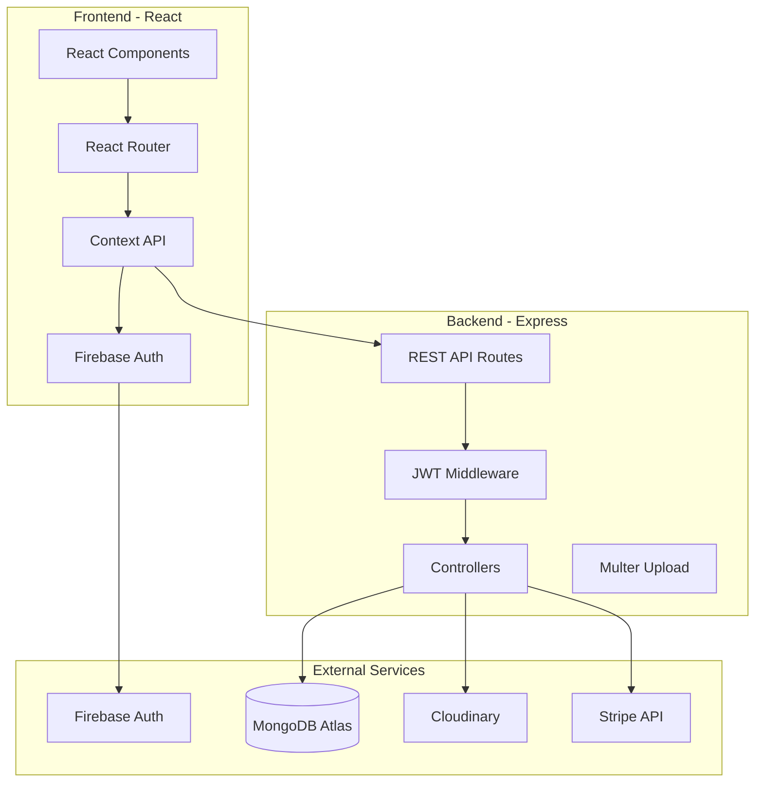

# E-commerce Gift Shop

- Full Stack Implementation Plan

## Project Structure

```javascript
gifts/
├── frontend/                 # React.js application
│   ├── public/
│   ├── src/
│   │   ├── components/      # Reusable UI components
│   │   ├── pages/          # Page components
│   │   ├── context/        # Context API (Cart, Auth)
│   │   ├── services/       # API calls, Firebase config
│   │   ├── utils/          # Helper functions
│   │   ├── hooks/          # Custom React hooks
│   │   └── App.js
│   ├── package.json
│   └── tailwind.config.js
├── backend/                  # Node.js + Express API
│   ├── src/
│   │   ├── models/         # MongoDB schemas
│   │   ├── routes/         # API routes
│   │   ├── controllers/    # Business logic
│   │   ├── middleware/     # Auth, validation, upload
│   │   ├── config/         # DB, JWT config
│   │   └── server.js
│   ├── package.json
│   └── .env.example
└── README.md
```


## Architecture Overview




## Implementation Phases

### Phase 1: Project Setup & Configuration

**Frontend Setup:**

- Initialize React app with Vite or Create React App
- Install dependencies: react-router-dom, tailwindcss, axios, firebase
- Configure Tailwind CSS with custom theme
- Set up folder structure and routing

**Backend Setup:**

- Initialize Node.js project with Express
- Install dependencies: express, mongoose, jsonwebtoken, bcryptjs, multer, cloudinary, stripe, cors, dotenv
- Configure MongoDB Atlas connection
- Set up environment variables structure
- Create basic Express server with middleware

### Phase 2: Authentication System

**Firebase Configuration:**

- Set up Firebase project configuration
- Configure Firebase Auth for email/password, phone, and Google Sign-In
- Create Firebase service utilities in frontend

**Backend Auth:**

- Create User model (MongoDB schema) with roles (user/admin)
- Implement JWT token generation and verification middleware
- Create auth routes: `/api/auth/register`, `/api/auth/login`, `/api/auth/verify-otp`
- Handle Firebase token verification and JWT creation
- Implement phone number validation for Sri Lankan format (+94)

**Frontend Auth:**

- Create AuthContext for global auth state
- Build registration page with email/phone options
- Build login page with multiple auth methods
- Implement OTP verification flow
- Create protected route wrapper component

### Phase 3: Product Management

**Backend:**

- Create Product model with fields: name, description, category, images, originalPrice, discountPrice, stock, ratings, reviews
- Create Category model
- Implement product CRUD routes (admin only)
- Add product search and filter endpoints
- Set up Multer + Cloudinary for image uploads

**Frontend:**

- Create ProductContext for product state
- Build ProductListing page with grid layout
- Build ProductDetails page with image gallery
- Implement search functionality
- Implement category filtering
- Create responsive product cards

### Phase 4: Cart & Wishlist

**Backend:**

- Extend User model with cart and wishlist arrays
- Create cart routes: add, remove, update quantity
- Create wishlist routes: add, remove, get

**Frontend:**

- Create CartContext for cart state management
- Build Cart page with quantity controls
- Build Wishlist page
- Add "Add to Cart" and "Buy Now" buttons
- Implement cart persistence (localStorage + backend sync)

### Phase 5: Reviews & Ratings

**Backend:**

- Create Review model (user, product, rating, comment, date)
- Add review routes: create, get by product, update, delete
- Calculate average ratings on products

**Frontend:**

- Build Review component with star ratings
- Display reviews on product details page
- Create review form (authenticated users only)
- Show average rating on product cards

### Phase 6: Admin Panel

**Backend:**

- Create admin middleware to check user role
- Admin product routes: create, update, delete
- Admin order routes: get all orders, update status
- Admin payment verification route

**Frontend:**

- Create AdminDashboard page (protected admin route)
- Build ProductManagement component (CRUD operations)
- Build OrderManagement component with status updates
- Build PaymentVerification component for bank transfers
- Create admin navigation and layout

### Phase 7: Order & Payment System

**Backend:**

- Create Order model (user, products, total, paymentMethod, paymentStatus, orderStatus, paymentSlip)
- Create order routes: create, get user orders, get all orders (admin)
- Integrate Stripe for card payments (test mode)
- Handle payment slip upload for bank transfers
- Implement order status workflow

**Frontend:**

- Build Checkout page with payment method selection
- Integrate Stripe Elements for card payment
- Create payment slip upload component
- Build OrderConfirmation page
- Create OrderHistory page for users

### Phase 8: UI/UX Polish

**Responsive Design:**

- Mobile-first approach with Tailwind breakpoints
- Responsive navigation (hamburger menu for mobile)
- Touch-friendly buttons and inputs
- Optimize images and loading states

**User Experience:**

- Add loading spinners and skeletons
- Implement toast notifications for actions
- Add form validation and error handling
- Create 404 and error pages

### Phase 9: Deployment Configuration

**Frontend (Vercel/Netlify):**

- Create `vercel.json` or `netlify.toml`
- Configure environment variables
- Set up build scripts

**Backend (Render/Railway):**

- Create deployment configuration
- Set up environment variables
- Configure MongoDB Atlas connection string
- Set up Cloudinary credentials

**Documentation:**

- Create comprehensive README with setup instructions
- Document API endpoints
- Include environment variable examples

## Key Files to Create

### Frontend Core Files:

- `frontend/src/App.js` - Main app component with routing
- `frontend/src/context/AuthContext.js` - Authentication state
- `frontend/src/context/CartContext.js` - Cart state management
- `frontend/src/services/api.js` - Axios instance with interceptors
- `frontend/src/services/firebase.js` - Firebase configuration
- `frontend/src/pages/Home.js` - Landing page
- `frontend/src/pages/Products.js` - Product listing with filters
- `frontend/src/pages/ProductDetails.js` - Product detail view
- `frontend/src/pages/Cart.js` - Shopping cart
- `frontend/src/pages/Checkout.js` - Checkout process
- `frontend/src/pages/Admin/Dashboard.js` - Admin dashboard

### Backend Core Files:

- `backend/src/server.js` - Express server setup
- `backend/src/config/database.js` - MongoDB connection
- `backend/src/models/User.js` - User schema
- `backend/src/models/Product.js` - Product schema
- `backend/src/models/Order.js` - Order schema
- `backend/src/models/Review.js` - Review schema
- `backend/src/middleware/auth.js` - JWT verification
- `backend/src/middleware/admin.js` - Admin role check
- `backend/src/middleware/upload.js` - Multer configuration
- `backend/src/routes/auth.js` - Authentication routes
- `backend/src/routes/products.js` - Product routes
- `backend/src/routes/orders.js` - Order routes
- `backend/src/routes/admin.js` - Admin routes

## Sample Data Structure

**Categories:**

- Photo Frames
- Duro Frames (Plymount)
- UV Frames
- Mugs (Normal Mug & Magic Mug)
- Other Gift Items

**Sample Products:**

- Include 2-3 products per category with images, prices, descriptions
- Include sample reviews and ratings

## Security Considerations

- JWT tokens with expiration
- Password hashing (handled by Firebase)